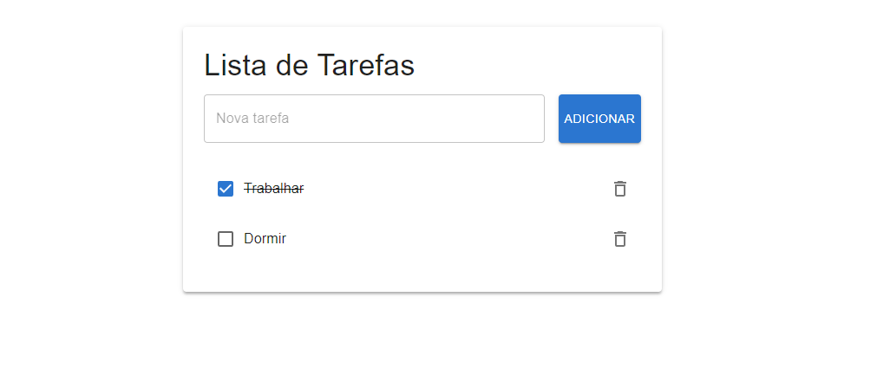

# Lista de Tarefas com React, TypeScript e Firebase

Este projeto é uma aplicação web de lista de tarefas desenvolvida com **React**, **TypeScript** e **Firebase**. Ele oferece uma interface de usuário intuitiva para gerenciar tarefas diárias, com funcionalidades de adição, exclusão e marcação de tarefas como concluídas.

## Características
- Interface de usuário moderna e responsiva usando **Material-UI**
- Armazenamento em tempo real com **Firebase Firestore**
- Paginação para carregar tarefas de forma eficiente (10 por página)
- Funcionalidades de adicionar, excluir e marcar tarefas como concluídas
- Desenvolvido com **TypeScript** para maior segurança e manutenibilidade do código
- Utiliza **Vite** para um ambiente de desenvolvimento rápido e eficiente

## Pré-requisitos

Antes de iniciar, certifique-se de ter instalado em sua máquina:
- **Node.js** (versão 14 ou superior)
- **npm** (normalmente vem com Node.js)
- Uma conta no **Firebase** e um projeto criado

## Instalação

1. Clone o repositório:
   ```bash
   git clone https://github.com/thiiagofernando/todo-list-tarefas.git
   cd lista-de-tarefas
   npm install

2. Adicione as configurações do Firebase no arquivo fiebase.ts
   ```bash
   const firebaseConfig = {
        apiKey: "",
        authDomain: "",
        projectId: "",
        storageBucket: "",
        messagingSenderId: "",
        appId: "",
        measurementId: ""
    };  

3. Execute o projeto:
   ```bash
   npm run dev

4. Acesso no navegador com a url gerada:
   ```bash
   http://localhost:5173/

